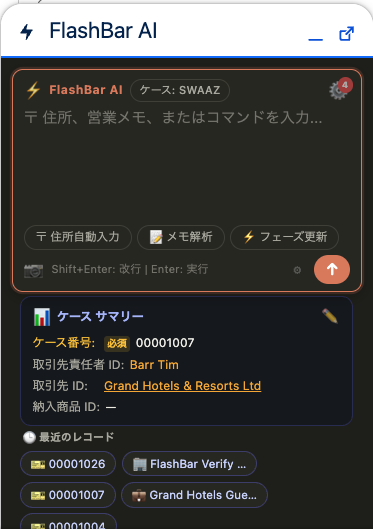
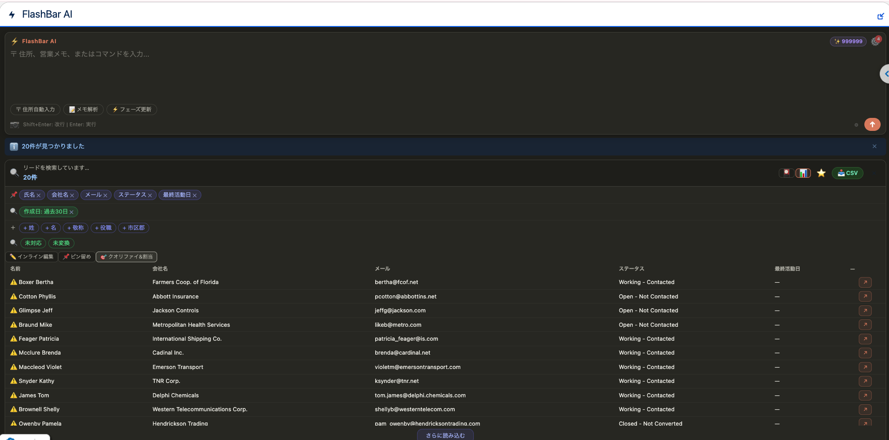

# FlashBar AI — インストール・設定マニュアル

対象: Salesforce管理者。Setup画面での操作に慣れていれば、CLIなしでも本マニュアルだけで導入できます。

最新パッケージ: [Releases](https://github.com/furuCRM-Inc/furu-agent-bar/releases/latest) を参照してください。

---

## 目次

1. [事前準備](#1-事前準備)
2. [パッケージのインストール](#2-パッケージのインストール)
3. [権限セットの割り当て](#3-権限セットの割り当て)
4. [Utility Barへの追加](#4-utility-barへの追加)
5. [動作確認](#5-動作確認)
6. [Lead Assigner（リード評価＆割当）の設定](#6-lead-assignerリード評価割当の設定)
7. [Case Triage（ケーストリアージ）の設定](#7-case-triageケーストリアージの設定)
8. [トラブルシューティング](#8-トラブルシューティング)

---

## 1. 事前準備

| 項目 | 内容 |
|---|---|
| 対象組織 | Production / Developer Edition / Sandbox いずれも可 |
| 権限 | 「アプリケーションのカスタマイズ」権限を持つ管理者アカウント |
| ネットワーク | 追加設定不要（Named Credential / Remote Site Settingsはパッケージに同梱） |

> **注意**: 本パッケージにはAgentforce Vision OCR機能（画像/PDF解析による自動データ取込）は含まれていません。これは検証専用組織で`ConnectApi.EinsteinLLM`権限が付与できないための制約です。CSVアップロードによる一括取込には影響ありません。ソースからの直接デプロイであれば含めることが可能です（[docs/CUSTOMIZATION.md](CUSTOMIZATION.md)参照）。

---

## 2. パッケージのインストール

1. [最新リリース](https://github.com/furuCRM-Inc/furu-agent-bar/releases/latest)を開く
2. 対象組織の種別に応じてリンクをクリック:
   - **本番組織 / Developer Edition** → "Production / Developer" のInstallリンク
   - **Sandbox** → "Sandbox" のInstallリンク
3. Salesforceのログイン画面が表示されるので、対象組織の管理者アカウントでログイン
4. 「パッケージのインストール」画面が表示される
   - **インストール対象**: 「管理者のみにインストール」を選択（推奨。後で権限セットにより個別ユーザーへ展開）
   - 「インストール」ボタンをクリック
5. 「サードパーティ製アクセスの承認」画面が出る場合がある:
   - 本パッケージが呼び出す外部エンドポイント（Cloudflare Worker: `flash-agent-stack.flash-agent-backend.workers.dev`）へのアクセス許可を確認し、「はい、これらのサードパーティ製サイトへのアクセスを許可します」にチェックを入れて続行
6. インストール完了メールが届くまで数分待つ（大規模組織では長くなる場合があります）

---

## 3. 権限セットの割り当て

パッケージには2つの権限セットが含まれます。

| 権限セット | 対象ユーザー | 内容 |
|---|---|---|
| `FlashBar_User` | 利用する全ユーザー | コマンドパレット、検索、一括編集、CSVインポート、リード評価、ケーストリアージなど全機能 |
| `FlashBar_Admin` | 管理者のみ（任意） | 自己学習ルールの承認パネル、デバッグパネル（意図分類・信頼度・レイテンシ表示） |

**割り当て手順**:

1. `Setup` → `Quick Find` で「権限セット」(Permission Sets) を検索
2. `FlashBar_User` をクリック
3. 「割り当ての管理」(Manage Assignments) → 「割り当ての追加」(Add Assignments)
4. 対象ユーザーにチェックを入れて「割り当て」(Assign)
5. 管理者機能を使う場合は `FlashBar_Admin` でも同様に割り当てる

---

## 4. Utility Barへの追加

FlashBar AIはLightning ExperienceのUtility Bar（画面下部の常駐ツールバー）に配置します。

1. `Setup` → `Quick Find` で「アプリマネージャー」(App Manager) を検索
2. FlashBarを使いたいLightningアプリ（例: Sales、Service）の行末のプルダウン → 「編集」(Edit)
3. 左メニューから「Utility項目」(Utility Items) を選択
4. 「Utility項目の追加」(Add Utility Item) → 「furuAgent Bar」を検索して選択
5. プロパティ設定（任意）:
   - パネルの幅・高さ: 初期値で問題ありません（ユーザーがドラッグでリサイズ可能）
6. 「保存」(Save) → 「有効化」(Activate) を確認

これで対象アプリを開いているすべてのユーザーの画面下部にFlashBar AIのアイコンが表示されます。

---

## 5. 動作確認

1. 対象Lightningアプリを開く
2. 画面下部のUtility Barで「⚡ FlashBar AI」アイコンをクリックしてパネルを開く
   - キーボードショートカット: `Cmd+/`（macOS）/ `Ctrl+/`（Windows）でも開閉できます
   - `Cmd+K` は多くの環境で動作しますが、**macOS版Chromeではブラウザ自身の「タブを検索」機能に予約されているため反応しないことがあります**。その場合は `Cmd+/` を使ってください
3. 入力欄に自然文で検索してみる:
   - 日本語: 「取引先を5件見せて」
   - English: "show me 5 accounts"
4. 検索結果がテーブル/カード表示されれば正常に動作しています

うまく動かない場合は [トラブルシューティング](#8-トラブルシューティング) を参照してください。

---

## 6. Lead Assigner（リード評価＆割当）の設定

**追加設定は不要です。** 権限セット割り当てが完了していればすぐに使えます。

**使い方**:

1. FlashBar AIで「すべてのリードを見せて」/ "show all leads" のように検索
2. 結果を📊テーブル表示に切り替え
3. リード検索結果のときのみ表示される **「🎯 クオリファイ&割当」** ボタンをクリック
4. 自動でAIによるICPスコアリング（HOT / WARM / COLD + 理由）が実行されます
5. 「担当者を検索...」欄でユーザーを検索し「+ 追加」（複数名可）
6. 最小ICPスコアの閾値を設定（0のままにすると全リードが対象。閾値を上げるとスコア未達のリードは割当対象から除外）
7. 「🎯 割り当てる」をクリックするとラウンドロビン方式で選択したリードが担当者へ均等に割り当てられます

---

## 7. Case Triage（ケーストリアージ）の設定

こちらは**手動でのページ配置が1回だけ必要**です（パッケージインストールだけでは有効になりません）。

> **なぜ自動化できないのか**: Salesforceのレコードページのタブ/サイドバー構成は、標準アプリが持つ「基底ページ」を継承する仕組みになっており、Case用の汎用的な基底ページはすべての組織エディションで保証されていません。そのためLightning App Builderでの対話的な検証を経る必要があり、メタデータデプロイだけでは組み込めません。

**設定手順**:

1. 任意のケースレコードを開く
2. 画面右上の歯車アイコン（⚙）→「ページを編集」(Edit Page)
3. 左側のコンポーネント一覧（Lightningコンポーネント）から「**FlashBar Case Triage Card**」を検索
4. ページ上の任意の位置（右サイドバー推奨）へドラッグ&ドロップ
5. 右上の「保存」(Save)
6. 保存後に表示される確認ダイアログで「有効化」(Activate) を選択
   - 「組織全体のデフォルトにする」(Assign as Org Default) を選ぶと、全ユーザー・全プロファイルのケースページに反映されます
   - 特定のアプリ/プロファイルのみに適用したい場合は該当の割り当てを選択
7. ケースページに戻り、カードが表示されることを確認

**使い方**: カードは自動的にそのケースのコンテキスト（件名・説明・取引先のSLA階層）をAIへ送信し、緊急度・解約リスクスコア、推奨キュー、エスカレーション要否を数秒で表示します。「割り当てる」ボタンで推奨キューへケースの所有者を変更できます。

---

## 8. トラブルシューティング

| 症状 | 原因・対処 |
|---|---|
| `Cmd+K` が反応しない | macOS Chromeのブラウザ予約ショートカットと競合しています。`Cmd+/` を使ってください |
| Utility Barにアイコンが出ない | 手順4のアプリ編集で「有効化」まで完了しているか確認。ブラウザの再読み込み・再ログインも試してください |
| 検索結果が出ない/エラーが出る | サードパーティ製アクセスの承認（手順2-5）が完了しているか確認。`Setup → リモートサイト設定` に `FuruAgent_Backend` が有効な状態で登録されているか確認 |
| 「🎯 クオリファイ&割当」ボタンが出ない | Lead（リード）オブジェクトの検索結果でのみ表示されます。他オブジェクトの検索結果では意図的に非表示です |
| Case Triageカードが表示されない | 手順7の「ページを編集」→ドラッグ配置→有効化が完了しているか確認してください |
| AIの理由（reasoning）が英語のまま | v1.0.0.2以降で修正済みです。パッケージを最新版に更新してください（[Releases](https://github.com/furuCRM-Inc/furu-agent-bar/releases/latest)） |
| ICPスコア/トリアージでタイムアウトする | v1.0.0.2でコールアウトタイムアウトを延長済みです。最新版へのアップデートをお試しください |

解決しない場合は [Issues](https://github.com/furuCRM-Inc/furu-agent-bar/issues) へご報告いただくか、`contact@furucrm.com` までご連絡ください。

---

## 関連ドキュメント

- [README](../README.md) — プロジェクト概要、機能一覧、開発者向けセットアップ
- [docs/CUSTOMIZATION.md](CUSTOMIZATION.md) — カスタマイズ方法、Worker自己ホスティング、新機能追加の手順
